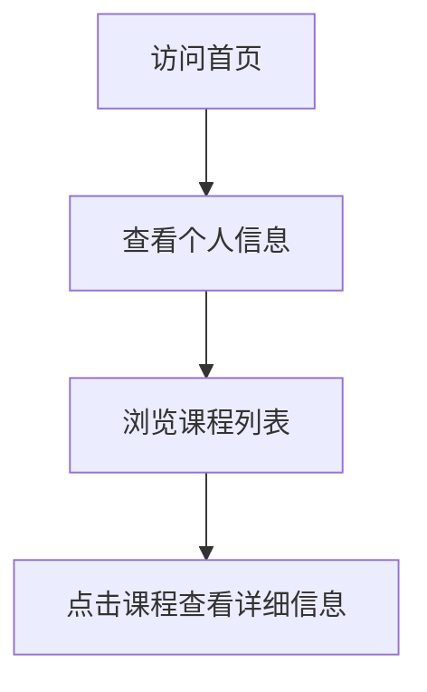

## 1. Product Overview
个人页面展示，用于展示广东科学技术职业学院商学院商务数据分析与应用专业学生黄安德的课程信息。
- 主要目的是提供一个简洁的平台，展示个人课程信息，方便后续补充课程内容。
- 目标用户是同学、老师和潜在雇主，展示个人学习成果和专业能力。

## 2. Core Features

### 2.1 User Roles
| 角色 | 注册方式 | 核心权限 |
|------|---------------------|------------------|
| 访问者 | 无需注册 | 浏览所有课程信息 |

### 2.2 Feature Module
1. **首页**：个人信息展示，课程列表，导航栏

### 2.3 Page Details
| 页面名称 | 模块名称 | 功能描述 |
|-----------|-------------|---------------------|
| 首页 | 个人信息 | 展示学生姓名、学校、专业等基本信息 |
| 首页 | 课程列表 | 展示所有课程信息，包括课程名称、简介等 |
| 首页 | 导航栏 | 提供页面导航功能 |

## 3. Core Process
用户访问首页 → 查看个人信息 → 浏览课程列表 → 点击课程查看详细信息（后续补充）

## 4. User Interface Design
### 4.1 Design Style
- 主色调：蓝色系 (#1E40AF) 和白色 (#FFFFFF)
- 辅助色：浅灰色 (#F3F4F6) 和深灰色 (#374151)
- 按钮风格：圆角按钮，悬停效果
- 字体：无衬线字体，标题使用较大字号
- 布局风格：卡片式布局，清晰的信息层次
- 图标风格：简洁线条图标

### 4.2 Page Design Overview
| 页面名称 | 模块名称 | UI元素 |
|-----------|-------------|-------------|
| 首页 | 个人信息 | 居中布局，大标题展示姓名，副标题展示学校和专业，简洁的个人简介 |
| 首页 | 课程列表 | 网格布局，每个课程以卡片形式展示，包含课程名称和简介 |
| 首页 | 导航栏 | 顶部导航，包含页面标题和可能的其他导航链接 |

### 4.3 Responsiveness
- 桌面优先设计，同时支持平板和移动设备
- 响应式布局，在不同屏幕尺寸下自动调整
- 触摸设备优化，确保在移动设备上的良好体验

### 4.4 3D Scene Guidance
- 不适用，本项目为静态页面