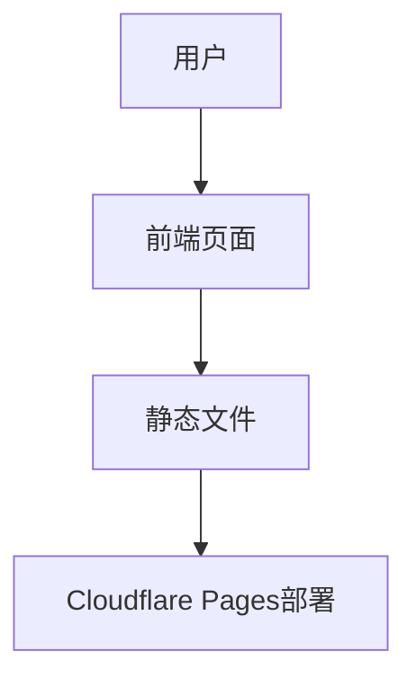

## 1. Architecture Design

## 2. Technology Description
- 前端：React@18 + tailwindcss@3 + vite
- 初始化工具：vite-init
- 后端：无（纯静态页面）
- 数据库：无（纯静态页面）

## 3. Route Definitions
| 路由 | 用途 |
|-------|---------|
| / | 首页，展示个人信息和课程列表 |

## 4. API Definitions
- 不适用，本项目为纯静态页面，无API调用

## 5. Server Architecture Diagram
- 不适用，本项目为纯静态页面，无服务器架构

## 6. Data Model
- 不适用，本项目为纯静态页面，无数据模型