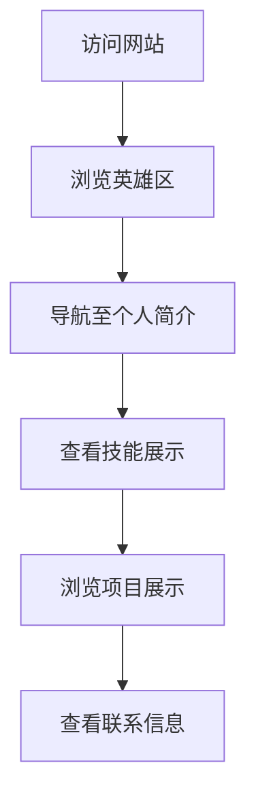

## 1. Product Overview
个人技术风格主页，展示黄安德同学的AI编程技能和专业背景。
- 目标用户为潜在雇主、同学和技术社区成员，展示个人技能和项目。
- 作为个人品牌展示平台，突出AI编程能力和商务数据分析专业背景。

## 2. Core Features

### 2.1 User Roles
| Role | Registration Method | Core Permissions |
|------|---------------------|------------------|
| Visitor | N/A | 浏览所有内容 |

### 2.2 Feature Module
1. **主页**: 英雄区、导航栏、个人简介、技能展示、项目展示、联系信息

### 2.3 Page Details
| Page Name | Module Name | Feature description |
|-----------|-------------|---------------------|
| 主页 | 英雄区 | 展示个人名称、专业和核心技能，带有科技风格的动画效果 |
| 主页 | 导航栏 | 固定顶部，包含个人简介、技能、项目、联系等导航链接 |
| 主页 | 个人简介 | 详细介绍个人背景、专业和职业目标 |
| 主页 | 技能展示 | 以可视化方式展示编程技能、工具和技术栈 |
| 主页 | 项目展示 | 展示个人项目、代码库和实践经验 |
| 主页 | 联系信息 | 提供联系方式和社交媒体链接 |

## 3. Core Process
用户访问网站 → 浏览个人简介和技能 → 查看项目展示 → 通过联系信息与用户取得联系

## 4. User Interface Design
### 4.1 Design Style
- 主色调：深蓝色(#0a192f)和亮青色(#64ffda)
- 辅助色：深灰色(#172a45)和白色(#ffffff)
- 按钮风格：圆角矩形，带有hover动画效果
- 字体：无衬线字体，主要使用Roboto和Orbitron
- 布局风格：卡片式布局，带有深度和层次感
- 图标风格：线性图标，带有科技感

### 4.2 Page Design Overview
| Page Name | Module Name | UI Elements |
|-----------|-------------|-------------|
| 主页 | 英雄区 | 大型标题，带有打字效果动画，背景为渐变深色，点缀科技元素 |
| 主页 | 导航栏 | 固定顶部，半透明背景，滚动时变化，包含简洁的导航链接 |
| 主页 | 个人简介 | 卡片式布局，包含个人照片、教育背景和职业目标 |
| 主页 | 技能展示 | 雷达图或条形图展示技能水平，带有交互效果 |
| 主页 | 项目展示 | 网格布局的项目卡片，带有悬停效果和详细信息 |
| 主页 | 联系信息 | 简洁的联系表单和社交媒体图标，带有动画效果 |

### 4.3 Responsiveness
- 桌面优先设计，适配不同屏幕尺寸
- 移动端自适应布局，确保在手机和平板上有良好的显示效果
- 触摸优化，确保在触摸设备上有良好的交互体验

### 4.4 3D Scene Guidance
- 背景可加入简单的3D粒子效果，增强科技感
- 使用CSS 3D变换创建深度感
- 避免过于复杂的3D效果，保持页面加载速度