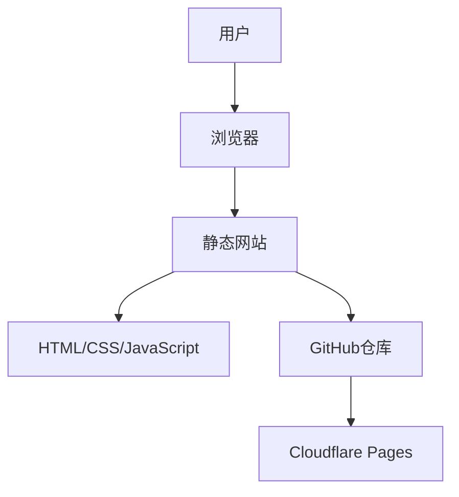

## 1. Architecture Design

## 2. Technology Description
- 前端：纯静态HTML5 + CSS3 + JavaScript
- 构建工具：无（纯静态）
- 后端：无
- 部署：GitHub + Cloudflare Pages

## 3. Route Definitions
| Route | Purpose |
|-------|---------|
| / | 主页，包含所有内容 |

## 4. API Definitions
无API定义，纯静态网站

## 5. Server Architecture Diagram
无服务器架构，纯静态网站

## 6. Data Model
无数据模型，纯静态网站